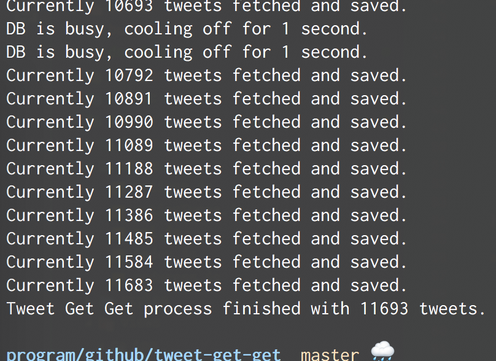
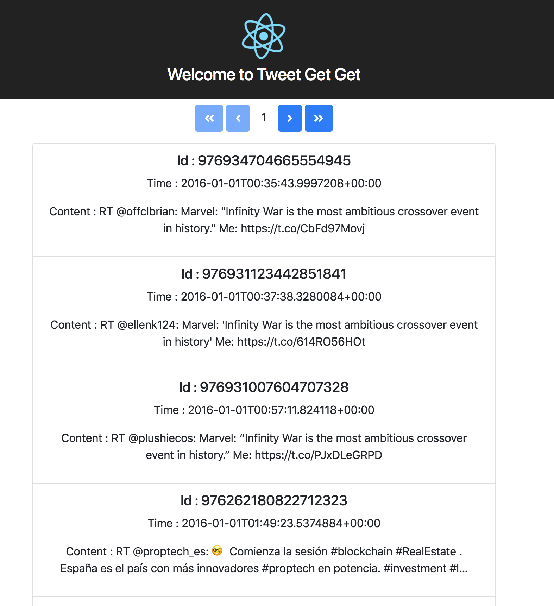

# Tweet Get Get

Master 💻 | GreenKeeper 🌱
--- | ---
[](https://travis-ci.com/shawnkoon/tweet-get-get) |

React application to fetch tweets with bad restful api.

## Execution Steps (Command Line)

1. Install Node & NPM. v8.x v5.x Recommended.

2. Install node dependencies.

```bash
λ npm install
```

### ETL from BAD API -> Local DB Server

3. Open two terminals one for the DB server, one for the app.

4. On one of the terminal session, run `JSON-SERVER` and leave it running.

```bash
λ npm run start:db
```

5. On the other terminal session, run `tweet-etl` project.

```bash
λ npm run start:etl
```

(It will cool off if DB is busy.)

6. Once the etl project finishes, check `database.json` file to see the tweets.

### Viewing in UI

7. Making sure the DB server if up and running. (ref #4)

8. On the new terminal session, run `react Tweet Get Get` project

```bash
λ npm run start
```

9. Either web opens up or just access `http://localhost:3000/`.




## Execution step (Docker)

1. Run `makefile` command.

```bash
λ make docker_run
```

2. When etl container executes it's process check the `database.json` file grow.

3. Check the webapp at `http://localhost:3000/`.

4. Clean up docker artifects.

```bash
λ make docker_clean
```
